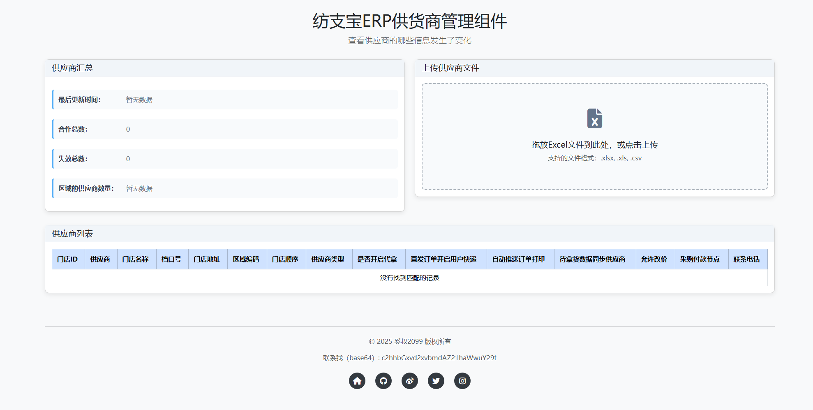

# fangzhibao-supplier-mgmt

一个用于检查纺支宝内置的供货商的信息是否存在更新的插件。

由于纺支宝会默认管理供货商信息，但却没有更新通知功能，有点不方便。

目前需通过定期手动上传文件比对，可以更新到自己的纺支宝的供应商模块内。



## 本地安装、运行

```sh
npm install
npm start

> localhost:3000
```

## 基础配置

- MySQL（只需要定义数据库，运行会自动建立对应的数据表）
- 通过 ``` .env.sample ``` 复制一个 ``` .env ``` 到项目目录，填写其中的数据，即可运行
	- ``` password字段 ``` 采用 bcryptjs 加密存储，默认 sault 为 10

## Backlogs

- [x] 上传、解析并展示excel文件中的供货商信息数据表
- [x] 增加对比并更新供货商信息功能
- [x] 增加登录模块
- [ ] 优化日志
- [ ] 优化UI部分表格交互和展示逻辑
- [ ] 其他功能优化